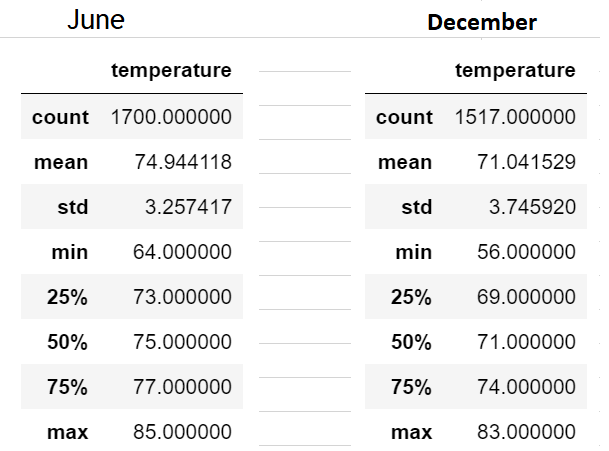

# surfs_up

## Overview
The purpose of this analysis was to analyze weather trends on the island 
of Oahu, Hawaii for a new small-business owner. 

## Results
* The average temperature in June is almost 4 degrees higher than the 
average temperature in December
* The max temperature is 85 degrees in June while the max temp is 83 degrees
in December.
* The standard deviation is .49 higher in December. 

## Summary
Based on the data analyzed in this challenge, there is little to no 
difference in the year round temperature changes on the island of Oahu,
making this a great location to open up a small business. 
